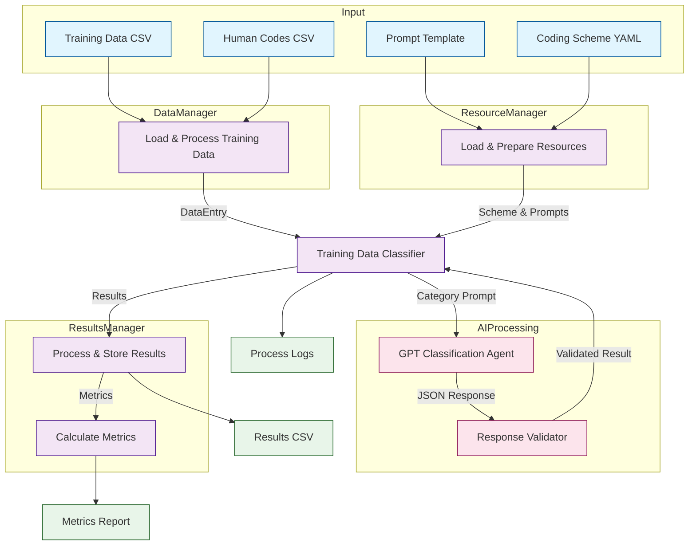

# AI Training Data Classification Pipeline

This pipeline processes educational training data using GPT to classify entries according to a predefined coding scheme. It's designed to automate the classification of training descriptions while maintaining high accuracy and validation standards.

## Overview

The pipeline consists of:
1. Data loading and validation
2. GPT-based classification
3. Response validation
4. Results and metrics calculation

## Prerequisites

- Python 3.8+
- OpenAI API key
- Required Python packages:
  ```bash
  pip install openai pandas pyyaml pydantic
  ```

## File Structure

project_root/
├── pipeline-draft1.0.py    # Main pipeline script
├── prompt.txt              # GPT prompt template
├── requirements.txt        # Python dependencies
├── utils/                  # Utility scripts
│   └── generate_test_data.py  # Test data generator
├── old_data_training/     # Training data directory
│   └── coding_scheme.yml  # Classification categories
└── logs/                  # Generated log files

## License

GNU General Public License v3.0

Copyright (c) 2024 [Your Institution/Name]

This program is free software: you can redistribute it and/or modify
it under the terms of the GNU General Public License as published by
the Free Software Foundation, either version 3 of the License, or
(at your option) any later version.

This program is distributed in the hope that it will be useful,
but WITHOUT ANY WARRANTY; without even the implied warranty of
MERCHANTABILITY or FITNESS FOR A PARTICULAR PURPOSE. See the
GNU General Public License for more details.

You should have received a copy of the GNU General Public License
along with this program. If not, see <https://www.gnu.org/licenses/>.

### Additional Terms

- When using this software, please cite: [Your citation information]
- The use of this software requires compliance with OpenAI's terms of service
- This software is intended for research and educational purposes 

## Pipeline Architecture



## Setup

1. Create a `.env` file in the project root:
```bash
OPENAI_API_KEY=your-api-key-here
```

2. Install dependencies:
```bash
pip install -r requirements.txt
```

## Development

To generate test data for development:
```bash
python utils/generate_test_data.py
```
This will create:
- teacher_training_data.csv: Sample training entries
- human_codes.csv: Simulated human codes
